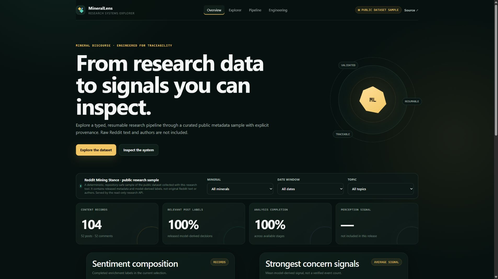
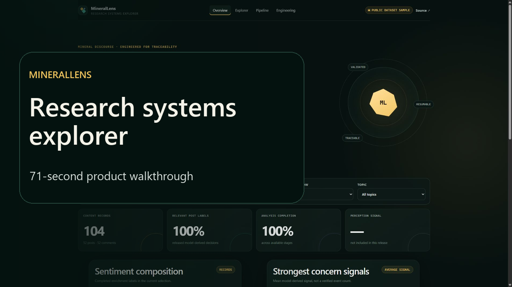
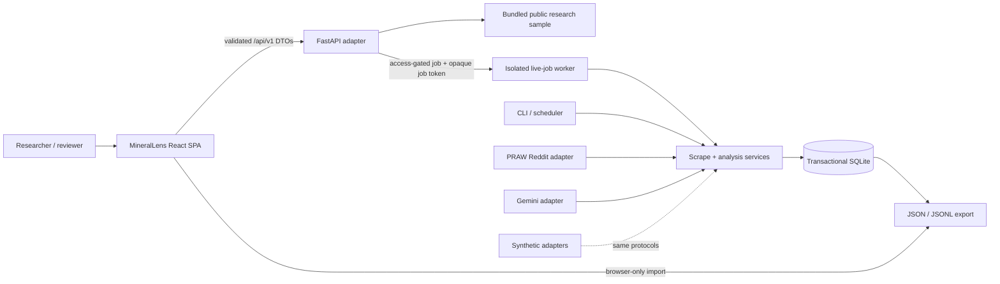

# MineralLens

[](https://github.com/Mohemed-Amine-Chalhy/reddit_minerals_scraper-/actions/workflows/ci.yml)
[](https://github.com/Mohemed-Amine-Chalhy/reddit_minerals_scraper-/actions/workflows/codeql.yml)


**Critical-minerals research intelligence.**

## From public discourse to decision-ready evidence

MineralLens is a full-stack system for collecting, analyzing, and exploring how
critical minerals are discussed online. Its strict TypeScript and React client,
typed FastAPI contracts, and resumable Python engine connect bounded Reddit
collection to schema-validated analysis, transactional SQLite state, and
inspectable research outputs.

[Explore the static review surface](https://mohemed-amine-chalhy.github.io/reddit_minerals_scraper-/)
· [Web application guide](docs/web-app.md)
· [API documentation](http://127.0.0.1:8000/api/v1/docs)

**1.04M published dataset records · 26 mineral topics · 351 passing tests ·
92.40% Python coverage**

> **Published research data:** the pipeline produced the owner’s
> [public Kaggle dataset](https://www.kaggle.com/datasets/mohamedaminechalhy/reddit-mining-stance),
> whose version 2 contains 1,042,563 released post/comment rows across 26
> mineral topics. The static GitHub Pages review surface uses a deterministic
> 104-record metadata sample from that release; it does not load the million-row
> dataset into the browser. The release omits original Reddit text and authors.
> Sentiment, stance, relevance, themes, and concerns are model-derived research
> signals rather than ground-truth labels or manuscript-wide findings.

[](https://mohemed-amine-chalhy.github.io/reddit_minerals_scraper-/)

### 71-second product walkthrough

[](https://github.com/Mohemed-Amine-Chalhy/reddit_minerals_scraper-/releases/download/v0.1.0-rc.1/walkthrough-1080p.mp4)

[Watch the 1080p H.264 walkthrough](https://github.com/Mohemed-Amine-Chalhy/reddit_minerals_scraper-/releases/download/v0.1.0-rc.1/walkthrough-1080p.mp4)
· [English captions](docs/media/walkthrough.en.srt)
· [Reproduction guide](docs/media/README.md)

## Research context

MineralLens grew from an industrial-engineering foundation at
[EMINES, Mohammed VI Polytechnic University](https://www.um6p.ma/) into the
international **Reputational Risk of Critical Metals** research internship at
[Mines Nancy](https://mines-nancy.univ-lorraine.fr/en/). The resulting
methodology produced the public million-row dataset and now supports an
associated manuscript in advanced review.

The application makes that research path inspectable end to end: provider
boundaries, resumable state, analysis contracts, operational evidence, and the
interface used to explore the results all live in one versioned system.

Built and maintained by
[Mohamed Amine Chalhy](https://github.com/Mohemed-Amine-Chalhy).

## Product surfaces

| Surface           | Capability                                                                                          |
| ----------------- | --------------------------------------------------------------------------------------------------- |
| Command Center    | Mineral-level KPIs, sentiment, stance, concerns, provenance, and recent activity                    |
| Research Explorer | URL-backed search and filters, responsive records, local JSON/JSONL import, and analysis detail     |
| Pipeline          | Deterministic reliability replay plus bounded Live Reddit jobs on an enabled backend                |
| Engineering       | System architecture, reliability decisions, measured quality evidence, and implementation links     |
| FastAPI           | Versioned read contracts, strict response models, bounded pagination, sanitized errors, and OpenAPI |

The interface is responsive, keyboard operable, reduced-motion aware, and safe
to run without provider credentials. A local compatible export is parsed in
browser memory and is never uploaded to the API. A trusted local or self-hosted
FastAPI instance can additionally expose disabled-by-default, bounded Live
Reddit jobs with progress, cooperative cancellation, and direct Explorer
handoff. The static GitHub Pages review surface remains a credential-free
demonstration of the published-data and offline-replay paths.

## Engineering evidence

| Signal | Verified implementation |
| --- | --- |
| Full stack | Strict TypeScript/React client, Zod boundary validation, typed FastAPI DTOs, and an injected read-repository seam |
| Reliability | Idempotent upserts, explicit work states, resumable batches, bounded retries, atomic exports, and stale-result rejection |
| Quality | 310 passing Python tests, 2 expected Windows symlink skips, 92.40% total Python coverage, 41 passing frontend tests, strict mypy, Ruff, ESLint, Vitest, and pre-commit/pre-push gates |
| Portability | Python 3.12/3.13 on Linux and Windows, pinned Node 24, locked `uv` and pnpm environments, and platform scripts |
| Delivery | Static GitHub Pages demo, production SPA/API container target, non-root runtime, immutable base images, and health checks |
| Security | Authenticated live-job creation, secret scanning, CodeQL for Python and JavaScript/TypeScript, dependency/container audits, bounded untrusted input, and content-safe logs |

## Architecture



The web layer is an adapter, not a second analysis engine. Live jobs reuse the
same PRAW-backed scrape service against isolated, retained SQLite state. Provider
clients and synthetic clients implement the same narrow protocols; SQLite
remains canonical operational state; snapshots and the UI are downstream views.

See [architecture and failure semantics](docs/architecture.md), the
[web application contract](docs/web-app.md), and the
[schema-v3 data model](docs/data-model.md).

## Run MineralLens locally

### Requirements

- Python 3.12 or 3.13
- [`uv`](https://docs.astral.sh/uv/)
- Node.js 24 (pinned in `.node-version`)
- pnpm 11.19.0

Bootstrap the locked Python and web workspaces:

```powershell
.\scripts\bootstrap-web.ps1
.\scripts\dev-web.ps1
```

```bash
./scripts/bootstrap-web.sh
./scripts/dev-web.sh
```

Open `http://127.0.0.1:5173`. Vite proxies `/api` to FastAPI on port `8000`.
When the API is unavailable, the client falls back visibly to the same bundled,
repository-safe public sample rather than hiding the delivery failure.

To enable bounded Reddit collection from `/pipeline`, configure the three
`RMS_REDDIT_*` application values, a fresh random `RMS_LIVE_ACCESS_TOKEN`, and
set `RMS_LIVE_REDDIT_ENABLED=true` in the FastAPI environment. PRAW obtains
OAuth access internally; no Reddit password or pre-generated bearer token is
needed. Follow the
[Live Reddit guide](docs/live-reddit.md) before enabling one-run browser
credentials or exposing the backend beyond localhost.

For a production-style local build:

```shell
pnpm --dir web build
uv run --locked --extra web uvicorn reddit_minerals.web.app:create_app --factory --host 127.0.0.1 --port 8000
```

FastAPI serves `web/dist` and the versioned API together at
`http://127.0.0.1:8000`.

## Credential-free pipeline demo

The CLI demo exercises the real services, state machine, SQLite transactions,
analysis identities, and export path with deterministic provider adapters:

```shell
uv run reddit-minerals demo
```

It uses no credentials and makes no network calls. Pass
`--output-dir demo-output` to retain the isolated database and JSONL export,
then load that export through the Research Explorer to test browser-local
inspection.

## Live-provider workflow

Copy `.env.example` to `.env`, provide only the credentials required for the
operation, and validate configuration without contacting a provider. The
long-running pipeline remains available through explicit CLI commands:

```shell
uv run reddit-minerals validate-config
uv run reddit-minerals scrape --mineral gold --max-posts 10 --max-comments 25 --dry-run
uv run reddit-minerals scrape --mineral gold --max-posts 10 --max-comments 25
uv run reddit-minerals relevance --mineral gold --limit 100
uv run reddit-minerals enrich --mineral gold --limit 100
uv run reddit-minerals reputation --mineral gold --limit 100
uv run reddit-minerals status
uv run reddit-minerals export --mineral gold --format jsonl --output exports/gold.jsonl
```

Exports are snapshot-consistent and refuse to overwrite an existing destination
unless `--overwrite` is explicit. Use `uv run reddit-minerals COMMAND --help`
for the authoritative option reference.

The web application can run collection-only jobs through the same service. Live
mode is off by default, supports server-managed credentials and an independently
gated one-run credential mode, applies hard request bounds, isolates each job's
database, requires a separate deployment token to create work, uses opaque
per-job access tokens, supports cooperative cancellation, and deletes retained
artifacts on a bounded schedule. Start with the
cross-platform low-limit canary documented in
[docs/live-reddit.md](docs/live-reddit.md). Gemini analysis remains a separate,
optional CLI operation and is never started silently by the browser.

## API surface

| Route | Purpose |
| --- | --- |
| `GET /api/v1/health` | Readiness plus explicit source/read-only state |
| `GET /api/v1/meta` | Product version, provenance, minerals, and totals |
| `GET /api/v1/dashboard` | Chart-ready aggregate metrics with an optional mineral filter |
| `GET /api/v1/snapshot` | One bounded, provenance-complete dataset transfer for first-party clients |
| `GET /api/v1/records` | Bounded pagination, search, filters, and sorting |
| `GET /api/v1/records/{id}` | One record with analysis detail and source note |
| `GET /api/v1/runs` | Read-only run summaries; empty for the public sample so history is never fabricated |
| `GET /api/v1/config` | Non-secret UI capabilities and filter values |
| `GET /api/v1/live/capabilities` | Disabled-by-default availability, credential modes, and safe job bounds |
| `POST /api/v1/live/jobs` | Start one bounded, isolated job with the deployment access token |
| `GET/DELETE /api/v1/live/jobs/{id}` | Poll progress or request cooperative cancellation with the job token |
| `GET /api/v1/live/jobs/{id}/snapshot` | Load a successful or partial live result into the Explorer |

The public-sample and Pages experiences remain credential-free. FastAPI always
registers the live contract so clients can discover disabled capabilities, but a
disabled job start returns a sanitized `503` and cannot construct a provider.
Creation requires the configured `X-Live-Access-Token`; every job-specific
request after creation requires the distinct returned `X-Live-Job-Token`. The
OpenAPI schema is available at `/api/v1/docs`.

## Development gates

Run the complete repository gate:

```powershell
.\scripts\check.ps1
```

```bash
./scripts/check.sh
```

For a focused web pass:

```powershell
.\scripts\check-web.ps1
```

```bash
./scripts/check-web.sh
```

The gates validate lockfiles, formatting, linting, strict Python and TypeScript
types, frontend and backend tests with coverage, documentation links, notebooks,
secret patterns, package artifacts, dependency advisories, offline smoke paths,
and production builds.

## Repository map

```text
web/                         React, TypeScript, Zod, Vitest, and product UI
src/reddit_minerals/web/     FastAPI factory, strict DTOs, repository, public sample
src/reddit_minerals/         Pipeline engine, providers, storage, CLI
tests/web/                   API contracts, isolation, errors, SPA fallback
tests/                       Engine unit, integration, failure, and race tests
configs/                     Validated mineral-to-subreddit mapping
scripts/                     Cross-platform bootstrap, dev, quality, and smoke tools
docs/                        Architecture, research method, operations, and web guides
notebooks/                   Optional output-free export exploration
```

## Documentation

- [Documentation index](docs/README.md)
- [Web application](docs/web-app.md)
- [Live Reddit collection](docs/live-reddit.md)
- [Public sample provenance and local imports](docs/demo-data.md)
- [Architecture](docs/architecture.md)
- [Data model](docs/data-model.md)
- [Configuration](docs/configuration.md)
- [Operations](docs/operations.md)
- [Deployment and rollback](docs/deployment.md)
- [Methodology and evaluation](docs/methodology.md)
- [Data-safety guarantees](docs/data-safety.md)
- [Walkthrough storyboard](docs/walkthrough.md)
- [Contributing](CONTRIBUTING.md) and [security](SECURITY.md)

No credentials, databases, raw Reddit text, Reddit authors, notebook outputs,
manuscript files, or evaluation documents are tracked. The only derived dataset
asset is the documented, identifier-hashed public metadata sample used by the
product interface.
