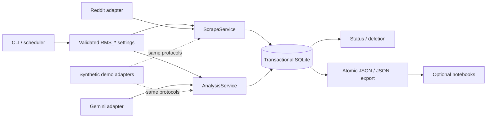

# Reddit Minerals Pipeline

[](https://github.com/Mohemed-Amine-Chalhy/reddit_minerals_scraper-/actions/workflows/ci.yml)
[](https://github.com/Mohemed-Amine-Chalhy/reddit_minerals_scraper-/actions/workflows/codeql.yml)


A production-oriented Python batch pipeline for collecting bounded public Reddit
discussions about minerals and running schema-validated analysis over them. It is
typed, resumable, offline-testable, and built around transactional SQLite.

I developed this system from an initial research prototype during my internship
at [Mines Nancy](https://mines-nancy.univ-lorraine.fr/en/). The portfolio version
shows the engineering work required to turn exploratory scripts into a
maintainable data product. Maintained by
[Mohamed Amine Chalhy](https://github.com/Mohemed-Amine-Chalhy).

## Engineering at a glance

| Signal | Verified evidence |
| --- | --- |
| Reliability | Idempotent upserts, explicit work states, resumable batches, atomic exports, durable deletion tombstones, and crash reconciliation |
| Concurrency | One tracked writer per database plus optimistic revision checks that reject stale in-flight analysis results |
| Quality | 260 deterministic offline tests, 95.64% branch coverage, strict mypy, Ruff, and pre-commit/pre-push gates |
| Portability | Python 3.12 and 3.13 exercised on Linux and Windows in CI |
| Delivery | Locked `uv` environment, wheel and source-distribution install tests, pinned CI actions, and a non-root container |
| Security | Secret scanning, CodeQL, dependency/container audits, parameterized SQL, bounded untrusted input, and content-safe logs |

## 60-second offline demo

Bootstrap once, then exercise the real services, database, analysis state, and
export path with deterministic synthetic provider adapters:

```powershell
.\scripts\bootstrap.ps1
uv run reddit-minerals demo
```

```bash
./scripts/bootstrap.sh
uv run reddit-minerals demo
```

The demo uses no credentials and makes no network calls. It creates an isolated
temporary workspace, runs collection and all analysis stages through the same
interfaces used by the live adapters, exports JSONL, prints a compact summary,
and cleans up its temporary artifacts.

Pass `--output-dir demo-output` to retain an isolated run directory containing
the SQLite database and JSONL export for inspection.

## Architecture



SQLite is the canonical operational state. Provider clients implement narrow
protocols; orchestration depends on those protocols rather than SDK objects.
Generated exports and notebooks are downstream views, never checkpoints.

## Engineering decisions

| Challenge | Decision | Evidence |
| --- | --- | --- |
| Provider SDK churn and live-test risk | Ports/adapters with injected Reddit and analysis clients | [Provider protocols](src/reddit_minerals/clients/base.py), [offline end-to-end test](tests/test_smoke.py) |
| Partial provider failures | Explicit work-state machine with transactional content/state updates | [Scrape service](src/reddit_minerals/services/scrape.py), [analysis service](src/reddit_minerals/services/analysis.py) |
| Overlapping jobs and late AI responses | Cross-process operation lock plus source/config/dependency revisions checked at commit time | [SQLite storage](src/reddit_minerals/storage/database.py), [race coverage](tests/test_database.py) |
| Rate limits and outages | Classified failures, exponential backoff with jitter, and run-wide deadlines | [Retry implementation](src/reddit_minerals/retry.py), [failure tests](tests/test_retry_observability.py) |
| Untrusted provider output | Strict Pydantic models, bounded fields, schema validation, and explicit blocked/invalid states | [Domain models](src/reddit_minerals/models.py), [client tests](tests/test_clients.py) |
| Packaging and environment drift | Checked-in lockfile, isolated wheel/sdist installation, multi-platform CI, and immutable container bases | [CI workflow](.github/workflows/ci.yml), [artifact verifier](scripts/check_artifacts.py) |

See [architecture and failure semantics](docs/architecture.md) and the
[schema-v3 data model](docs/data-model.md) for the full design.

## What it provides

- Read-only Reddit application authentication with bounded post/comment
  collection and explicit mineral selection.
- Separate relevance, enrichment, and reputation-analysis stages with validated
  provider responses and model/prompt/schema provenance.
- Transactional storage, refresh windows, resumable states, status reporting,
  content deletion, and legacy-data migration.
- Structured UTC logging, safe configuration summaries, bounded retries,
  non-zero failure exits, and snapshot-consistent exports.
- Output-free parameterized notebooks for optional downstream exploration.

## Live-provider quick start

### Requirements

- Python 3.12 or 3.13
- [`uv`](https://docs.astral.sh/uv/)
- A Reddit API application for live collection
- A Gemini API key and explicitly selected model for live analysis

Copy `.env.example` to `.env` and provide only the credentials required by the
commands you intend to run:

```dotenv
RMS_REDDIT_CLIENT_ID=replace-me
RMS_REDDIT_CLIENT_SECRET=replace-me
RMS_REDDIT_USER_AGENT=script:reddit-minerals-scraper:<version> (by u/<account>)
RMS_GEMINI_API_KEY=replace-me
RMS_GEMINI_MODEL=replace-with-an-evaluated-model-id
```

Validate settings without contacting either provider:

```shell
uv run reddit-minerals validate-config
```

Preview a bounded scrape, then run it:

```shell
uv run reddit-minerals scrape --mineral gold --max-posts 10 --max-comments 25 --dry-run
uv run reddit-minerals scrape --mineral gold --max-posts 10 --max-comments 25
```

Run analyses and inspect progress:

```shell
uv run reddit-minerals relevance --mineral gold --limit 100
uv run reddit-minerals enrich --mineral gold --limit 100
uv run reddit-minerals reputation --mineral gold --limit 100
uv run reddit-minerals status
```

Export a versioned research snapshot:

```shell
uv run reddit-minerals export --mineral gold --format jsonl --output exports/gold.jsonl
```

Exports never replace an existing destination unless `--overwrite` is explicit,
and they refuse the live database and its SQLite/operation sidecars.

## Command overview

| Command | Purpose | Provider access |
| --- | --- | --- |
| `demo` | Run the complete pipeline with deterministic synthetic adapters | None |
| `validate-config` | Validate settings and subreddit mapping | None |
| `scrape` | Collect or refresh posts and comments | Reddit |
| `relevance` | Classify mineral relevance | Gemini |
| `enrich` | Extract typed topics, sentiment, stance, and concerns | Gemini |
| `reputation` | Estimate documented content-level indicators | Gemini |
| `status` | Report record, work-state, and run counts | None |
| `export` | Write a JSON or JSONL snapshot | None |
| `delete-content` | Preview or delete content and derivatives | None |
| `migrate-legacy` | Preview or import legacy JSON-array files | None |

Use `uv run reddit-minerals COMMAND --help` as the authoritative option
reference. See [configuration](docs/configuration.md) for every environment
variable.

## Repository layout

```text
src/reddit_minerals/   Typed application package, provider ports, and CLI
tests/                 Unit, integration, failure-path, and race tests
configs/               Validated mineral-to-subreddit mapping
scripts/               Idempotent setup, quality, packaging, and smoke checks
notebooks/             Optional output-free exploration notebooks
docs/                  Architecture, data model, operations, and methodology
```

The credential-bearing prototype entry points and output-bearing exploratory
notebooks were removed. Only the package CLI is supported; legacy JSON data can
be imported with `migrate-legacy`.

## Documentation

- [Documentation index](docs/README.md)
- [Architecture and data flow](docs/architecture.md)
- [Data model and migrations](docs/data-model.md)
- [Configuration reference](docs/configuration.md)
- [Operations runbook](docs/operations.md)
- [Deployment and rollback](docs/deployment.md)
- [Methodology and evaluation](docs/methodology.md)
- [Data-safety guarantees](docs/data-safety.md)
- [Legacy migration](docs/migration.md)
- [Troubleshooting](docs/troubleshooting.md)
- [Contributing](CONTRIBUTING.md), [security](SECURITY.md), and
  [citation metadata](CITATION.cff)

## Development checks

Run the same complete gate used for release preparation:

```powershell
.\scripts\check.ps1
```

```bash
./scripts/check.sh
```

Tests are offline by default and never contact Reddit or Gemini. The full check
also builds, installs, and exercises the wheel and source distribution outside
the repository.

No collected datasets, Reddit user profiles, credentials, databases, exports, or
notebook outputs are tracked in the current tree. Live commands should always use
your own provider credentials and deliberately bounded inputs.
