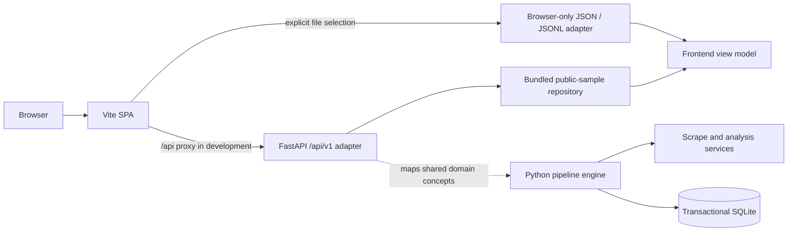

# Web application

The web application is a local portfolio and inspection surface for the Reddit
Minerals Pipeline. It presents the system's records, analysis provenance, run
state, and reliability decisions without becoming a second pipeline engine.

The default experience uses a deterministic, repository-safe sample of the
owner’s public Kaggle dataset. It does not contact Reddit or Gemini, request
provider credentials, read the operational SQLite database, or claim that its
charts are representative research findings. See
[demo-data.md](demo-data.md) for the complete provenance contract.

## Project context

MineralLens is the current product interface for research tooling developed
during a Mines Nancy internship. According to the project owner, an associated
manuscript is currently in advanced pre-publication review. That status does not
mean accepted, peer-reviewed, or published, and the web application must not
imply endorsement by Mines Nancy or any manuscript venue.

The formal supervisor evaluation praised the quality of the results, the
impressive workload, the completeness of the contribution, and the strong
written structure. That short paraphrase is the only evaluation context needed
in the public product story.

## Architecture



The production engine remains responsible for configuration validation,
provider adapters, retries, pipeline orchestration, persistence, work-state
transitions, migrations, deletion, and exports. The web package is an adapter:
it translates safe, read-only presentation data into versioned HTTP response
models and keeps HTTP concerns out of the services.

The default API repository loads the immutable 104-record public sample from a
packaged JSON resource. Endpoint handlers must not construct Reddit or Gemini
clients, load credentials, or write to the pipeline database. Live collection
and analysis remain CLI operations. The synthetic repository remains an
injectable test seam, not the product default. If a future feature reads an
operational database, it needs a separate, explicit read-only repository
contract rather than direct SQL in route handlers.

Production responses larger than 1 KB are gzip-compressed. The bounded snapshot
uses a weak content ETag plus a five-minute revalidation policy; content-hashed
frontend assets use a one-year immutable cache policy, while HTML remains
`no-cache` so deployments are discovered promptly.

## HTTP contract

All API routes are namespaced under `/api/v1`. The web surface is read-only:

| Route | Purpose |
| --- | --- |
| `GET /api/v1/health` | Lightweight process and API readiness |
| `GET /api/v1/meta` | Product, schema, source provenance, minerals, and totals |
| `GET /api/v1/dashboard` | Aggregate cards and chart-ready summaries |
| `GET /api/v1/snapshot` | One bounded, provenance-complete transfer that avoids client N+1 requests |
| `GET /api/v1/records` | Bounded, filterable record summaries |
| `GET /api/v1/records/{id}` | One record with analysis and provenance details |
| `GET /api/v1/runs` | Run summaries; intentionally empty for the public sample |
| `GET /api/v1/config` | Non-secret display configuration and capabilities |

The generated OpenAPI document is authoritative for query parameters and
response fields. Responses remain deterministic for the default public-sample
repository. Every response surface carries source kind, sample flags, counts,
and content-availability metadata. Errors use appropriate non-success status
codes and safe messages; the adapter must never replace a failed lookup with
fabricated content.

API responses are presentation DTOs, not a new canonical data model. The shared
Python models and service invariants remain the source of truth. Changes to a
domain enum, export schema, analysis identity, or work state require an explicit
adapter update and contract test.

## Frontend contract

The frontend is a React and TypeScript SPA built with Vite. Zod validates data
at the browser boundary before it reaches the presentation repository. In
development the SPA runs on
`http://127.0.0.1:5173` and proxies `/api` to the FastAPI process at
`http://127.0.0.1:8000`. Relative API URLs keep development and production
behavior aligned and avoid a separate browser CORS configuration.

The interface must always expose its active data source:

- `Read-only public research API` for FastAPI delivery of the 104-record sample;
- `Bundled public Kaggle research sample` for static/fallback delivery of the
  same canonical asset;
- `Synthetic pipeline export` for a locally imported CLI demo export; or
- `Local imported dataset` for any other user-selected file.

Public-sample labels and the missing-content explanation remain visible in
dashboard, record-detail, screenshot, and walkthrough views. Released scores
and model-derived labels may be displayed, but they are not presented as
ground-truth annotations, representative findings, or exact manuscript results.

Local JSON and JSONL imports are handled entirely with browser file APIs. They
do not traverse `/api`, upload to FastAPI, write to SQLite, or persist after a
page reload. Imported strings are untrusted data and must be rendered as text,
never injected as HTML. Parsing is atomic: an invalid or unsupported file leaves
the previous view intact and produces a useful local error.

## Configuration

The supported local configuration is intentionally small:

- FastAPI binds to `127.0.0.1:8000` in development.
- Vite binds to its default development port, `5173`.
- Vite proxies relative `/api` requests to the local FastAPI process.
- API compatibility starts at `/api/v1`.
- Built frontend assets are written to `web/dist`.
- `VITE_DATA_MODE=public-sample` creates the static Pages build without an API
  probe; local and container builds default to the API-first repository.
- FastAPI serves the SPA from `web/dist` when that directory is present; API
  routes always retain priority over the SPA fallback.

Frontend environment variables are public build inputs. Never place Reddit,
Gemini, database, or other credentials in a `VITE_*` variable or frontend
bundle. The public-sample web experience must start without `.env` and without
any provider configuration.

## Local development

The preferred setup commands are the repository scripts:

```powershell
.\scripts\bootstrap-web.ps1
.\scripts\dev-web.ps1
```

```bash
./scripts/bootstrap-web.sh
./scripts/dev-web.sh
```

The bootstrap scripts install locked Python and frontend dependencies. The
development scripts start both processes, wait for API health, and stop the API
when the frontend process exits.

For a manual two-terminal setup, install the Python package with the optional
web dependencies:

```shell
uv sync --extra web
```

Start the API from the repository root:

```shell
uv run uvicorn reddit_minerals.web.app:create_app --factory --reload --host 127.0.0.1 --port 8000
```

In a second terminal, install and start the frontend:

```shell
cd web
pnpm install --frozen-lockfile
pnpm dev
```

Open `http://127.0.0.1:5173`. The page should identify the default source as the
public research sample and should work without provider credentials.

## Build and production-style local run

Build the static frontend:

```shell
cd web
pnpm build
```

Then start FastAPI from the repository root without Vite. When `web/dist` is
present, the Python application serves both `/api/v1` and the SPA:

```shell
uv run uvicorn reddit_minerals.web.app:create_app --factory --host 127.0.0.1 --port 8000
```

This is a local demonstration deployment, not evidence that the application was
deployed or operated by Mines Nancy.

## Verification

Run the combined web check through the platform script:

```powershell
.\scripts\check-web.ps1
```

```bash
./scripts/check-web.sh
```

For focused frontend work, run the individual checks from `web`:

```shell
pnpm lint
pnpm typecheck
pnpm test
pnpm build
```

Run the web API tests from the repository root:

```shell
uv run pytest tests/web --no-cov
```

The full repository checks remain authoritative for the Python engine. Web tests
should cover route contracts, deterministic public-sample responses, absent raw
content, empty public run history, SPA fallback, provider isolation, explicit
synthetic replay, and browser-local import behavior. They must not make live
Reddit or Gemini calls.

## Walkthrough and media

- [walkthrough.md](walkthrough.md) defines the 60–75 second product story.
- [media/README.md](media/README.md) defines capture and delivery quality.
- [demo-data.md](demo-data.md) defines what may truthfully be said about the data.
